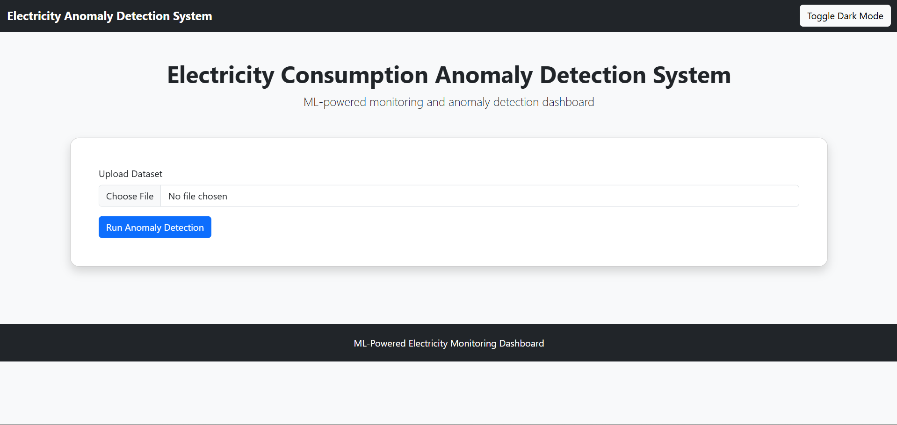
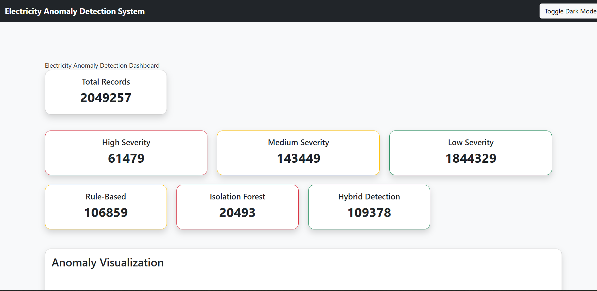
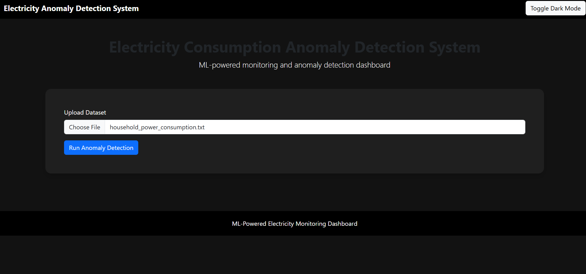

# ⚡ AI-Powered Electricity Consumption Pattern & Anomaly Detection System

## 🚀 Project Overview

An advanced AI-powered electricity monitoring and anomaly detection platform built using Machine Learning, Flask, and interactive analytics dashboards.

The system analyzes household electricity consumption patterns, detects abnormal usage behavior using both statistical and ML-based techniques, classifies anomaly severity levels, generates AI-powered insights, and visualizes electricity trends through an interactive web dashboard.

---

# 🌟 Key Features

✅ AI-generated electricity usage insights  
✅ Interactive Plotly analytics dashboard  
✅ Isolation Forest anomaly detection  
✅ Hybrid anomaly detection system  
✅ Severity classification engine  
✅ Electricity usage heatmaps  
✅ Downloadable anomaly reports  
✅ Dark mode dashboard  
✅ Responsive Flask web application  
✅ Interactive anomaly exploration  

---

# 🧠 Machine Learning Pipeline

## 1. Data Preprocessing
- Missing value handling
- Datetime conversion
- Numeric feature cleaning

## 2. Feature Engineering
- Hour extraction
- Day and weekday extraction
- Rolling averages
- Deviation calculation

## 3. Anomaly Detection
### Rule-Based Detection
Uses statistical deviation thresholds.

### Isolation Forest
Uses unsupervised machine learning for anomaly detection.

### Hybrid Detection
Combines ML + statistical methods for robust detection.

## 4. Severity Classification
Anomalies classified into:
- Low
- Medium
- High

## 5. AI Insight Generation
Automatically generates human-readable electricity usage insights and recommendations.

---

# 🖥️ Dashboard Preview

## Homepage



---

## Analytics Dashboard



---

## Dark Mode Dashboard


---

## Dark Mode Dashboard


---

# 📊 Dashboard Features

- Interactive Plotly charts
- Electricity anomaly visualization
- Severity pie charts
- Electricity usage heatmaps
- Top anomaly monitoring table
- AI-generated summaries
- Downloadable CSV reports

---

# 🏗️ Project Architecture

```text
User Upload
    ↓
Flask Backend
    ↓
Data Preprocessing
    ↓
Feature Engineering
    ↓
Isolation Forest + Rule Engine
    ↓
Hybrid Detection
    ↓
Severity Classification
    ↓
AI Insight Generation
    ↓
Interactive Dashboard

## 📂 Project Structure

```text
electricity-anomaly-detection-system/
│
├── app.py
├── requirements.txt
├── README.md
│
├── src/
│   ├── preprocessing.py
│   ├── feature_engineering.py
│   ├── anomaly_detection.py
│   ├── severity.py
│   ├── insights.py
│   └── visualization.py
│
├── templates/
│   ├── index.html
│   └── results.html
│
├── static/
│   ├── css/
│   │   └── style.css
│   │
│   ├── js/
│   │   └── script.js
│   │
│   └── plots/
│       ├── anomaly_plot.png
│       ├── heatmap.png
│       └── severity_pie.png
│
├── assets/
│   └── screenshots/
│       ├── homepage.png
│       ├── dashboard.png
│       └── darkmode.png
│
├── uploads/
├── outputs/
└── models/
# 🛠️ Technologies Used

| Category | Technologies |
|---|---|
| Backend | Flask |
| Machine Learning | Scikit-Learn |
| Data Processing | Pandas, NumPy |
| Visualization | Plotly, Matplotlib, Seaborn |
| Frontend | HTML, CSS, Bootstrap |
| Version Control | Git & GitHub |

---
# Future Improvements
Real-time electricity monitoring
IoT smart meter integration
Cloud deployment
Real-time streaming analytics
User authentication system
Advanced forecasting models
Mobile-responsive dashboard
Alert notification system